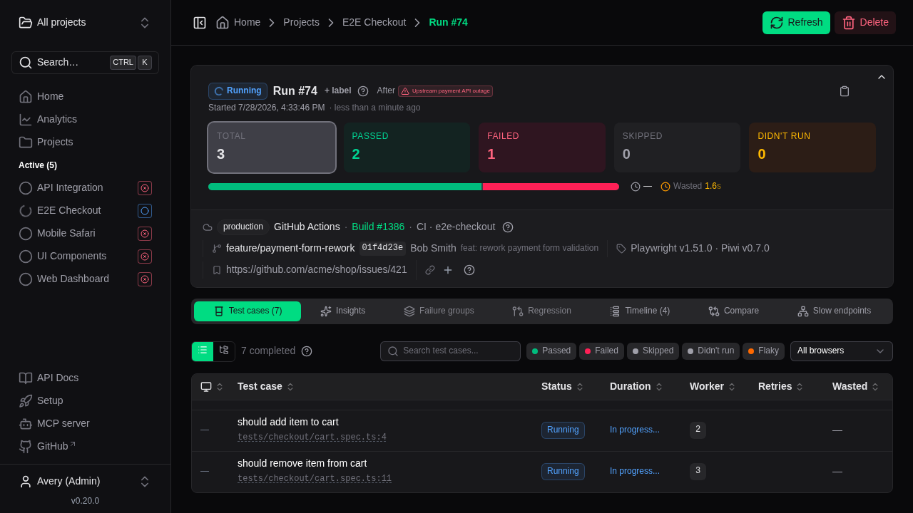
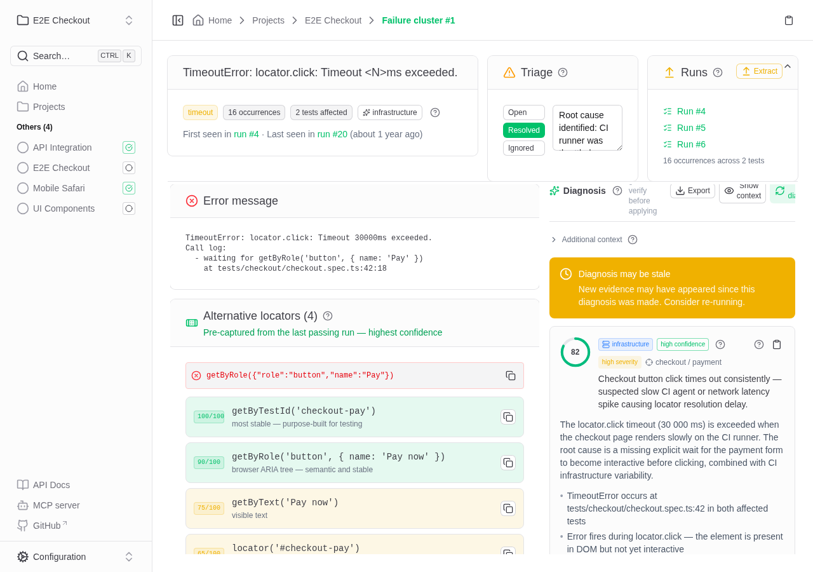
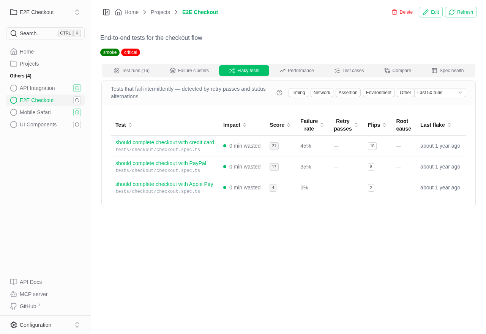
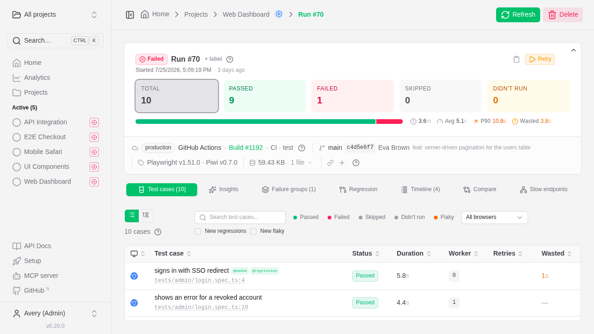
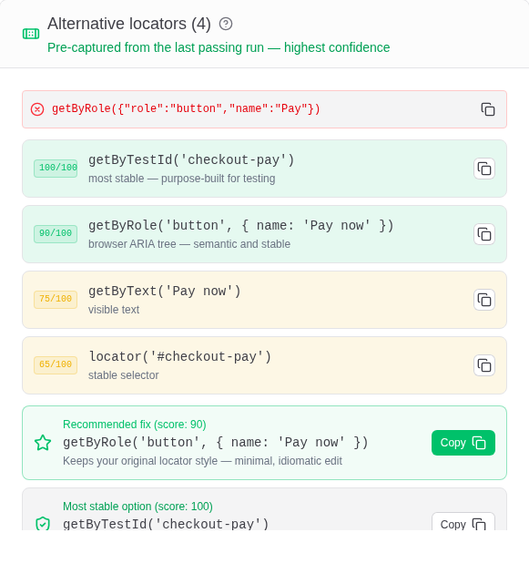
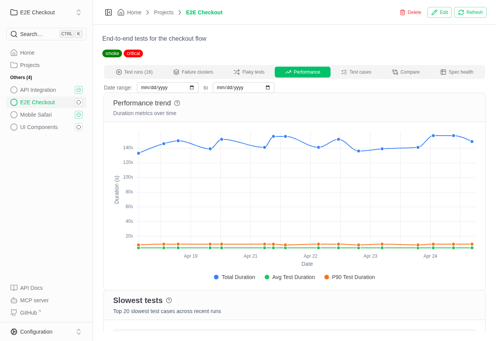

<p align="center">
  
</p>

<p align="center">
  <b>A permanent home for your Playwright test results.</b><br>
  CI reports vanish on every build. Piwi keeps them — and turns them into live dashboards,
  failure clusters, AI diagnosis, and cross-run analytics. Self-hosted, no SaaS.
</p>

<p align="center">
  <a href="https://piwitests.github.io/demo/"></a>
  <a href="https://piwitests.github.io"></a>
</p>

<p align="center">
  <a href="https://www.npmjs.com/package/@piwitests/reporter"></a>
  <a href="https://hub.docker.com/r/phenx/piwitests-server"></a>
  <a href="https://github.com/PiwiTests/platform/actions/workflows/ci.yml"></a>
  <a href="./LICENSE"></a>
  <a href="https://github.com/PiwiTests/platform/stargazers"></a>
</p>

<p align="center">
  <a href="https://piwitests.github.io/demo/">
    
  </a>
</p>

<p align="center">
  <sub>▶ <a href="https://piwitests.github.io/demo/">Click through to the live demo</a> — sample data, no install, runs entirely in your browser — or <a href="https://piwitests.github.io/#see-it-in-action">watch the 30-second clip</a>.</sub>
</p>

## Why Piwi?

Native Playwright HTML reports are great for local debugging — but they're ephemeral. Once the next CI run completes, the old report is gone. Piwi keeps every run and makes them connected, searchable, and actionable:

- 🗄️ **Permanent history** — every run, trace, and report stored and browsable across time.
- ⚡ **Live streaming** — watch runs in real time as CI executes; no polling, no waiting.
- 🔗 **Failure clustering** — failures sharing a root cause are auto-grouped by error fingerprint.
- 📈 **Performance & flaky tracking** — P90 duration trends, slowest tests, composite flakiness scores.
- 🩹 **Locator healing** — when a locator breaks, ranked replacement locators captured from prior passing runs, with a recommended fix.
- 🎬 **Self-hosted trace viewer** — open the full Playwright trace viewer from any failure; the trace stays on your server.
- 🔔 **Notifications** — email, Slack, webhook, and in-browser alerts for failed runs and new failure clusters.
- 🔌 **Built for automation** — drop-in reporter, REST API, OpenAPI docs, and an MCP server for agent integrations.
- ☁️ **Zero lock-in** — self-hosted with Docker; your data in SQLite/PostgreSQL and local/S3 storage.
- 🔒 **Private by design** — zero telemetry, no phone-home. The only outbound calls are the ones you configure (your AI provider, SMTP, S3).
- 🤖 **AI-assisted diagnosis** *(optional)* — LLM analysis of a failure cluster, grounded in your actual SCM diff, to speed up triage.

👉 **[Explore the live demo](https://piwitests.github.io/demo/)** — no install required.

## A quick tour

| | |
|---|---|
| [](https://piwitests.github.io/ai-diagnosis) | [](https://piwitests.github.io/ai-diagnosis) |
| **Failure clusters** — one root cause, one card | **AI diagnosis** — grounded in your actual git diff |
| [](https://piwitests.github.io/flaky-tests) | [](https://piwitests.github.io/ui-overview) |
| **Flaky tests** — scored, classified, impact-ranked | **Run detail** — cases, timeline, traces, retry command |
| [](https://piwitests.github.io/reporter#locator-healing) | [](https://piwitests.github.io/flaky-tests) |
| **Locator healing** — ranked replacements from passing runs | **Performance** — P90 trends and slowest-test tracking |

## Quick start

**1. Start the dashboard**

```bash
# Linux / macOS
mkdir -p .data && chown -R 1001:1001 .data # the container runs as non-root UID 1001
docker run -p 3000:3000 -v $(pwd)/.data:/app/.data phenx/piwitests-server:latest
```

```powershell
# Windows (PowerShell)
docker run -p 3000:3000 -v ${PWD}/.data:/app/.data phenx/piwitests-server:latest
```

Visit `http://localhost:3000`. A [`docker-compose.yml`](./docker-compose.yml) is also included.

> **Linux hosts:** the container runs as non-root UID 1001, so without the `chown` above, Docker auto-creates `.data` owned by `root` and the container can't write to it. Windows and macOS (Docker Desktop) don't need this step. See [Troubleshooting](./DOCKER.md#troubleshooting) if you hit a permission error.

> **Production tip:** set `PIWI_SECRET_KEY` (any long random string) so credentials you store in the dashboard — AI API keys, SCM tokens — are encrypted at rest. Generate one with `node -e "console.log(require('node:crypto').randomBytes(32).toString('hex'))"`. See the [deployment guide](https://piwitests.github.io/deployment).

**2. Add the reporter to your test project**

```bash
npm install --save-dev @piwitests/reporter
```

```typescript
// playwright.config.ts
import { defineConfig } from '@playwright/test'

export default defineConfig({
  reporter: [
    ['list'],
    ['@piwitests/reporter', {
      serverUrl: 'http://localhost:3000',
      projectName: 'my-project',
    }],
  ],
  use: { trace: 'retain-on-failure' },
})
```

**3. Run your tests** — `npx playwright test`. Results appear automatically; the project is created on first submission.

**4. Add the capture fixtures** *(recommended)* — one small file unlocks the richest features: locator healing, slow-endpoint analysis, Web Vitals, console capture, and failure-time ARIA snapshots.

```typescript
// tests/fixtures.ts
import { test as base, expect } from '@playwright/test'
import { piwiFixtures } from '@piwitests/reporter'

export const test = base.extend(piwiFixtures)
export { expect }
```

Import `test` from this file in your specs instead of `@playwright/test` — that's it. Full details in the **[capture fixtures guide](https://piwitests.github.io/capture-fixtures)**; a runnable example lives in [`examples/playwright-fixtures`](./examples/playwright-fixtures).

➡️ Full setup, configuration, and CI integration in the **[Getting started guide](https://piwitests.github.io/getting-started)**.

## How is this different from…?

| | Piwi | Playwright HTML report | Allure Report | ReportPortal | Currents |
|---|---|---|---|---|---|
| Run history across builds | ✅ | ❌ per-run, ephemeral | ➖ manual history files | ✅ | ✅ |
| Self-hosted | ✅ single container | — | ➖ static files | ✅ multi-service stack | ❌ SaaS |
| Live run streaming | ✅ | ❌ | ❌ | ➖ | ✅ |
| Playwright traces, first-class | ✅ | ✅ | ➖ | ➖ | ✅ |
| Flaky scoring & failure clustering | ✅ | ❌ | ❌ | ✅ ML triage | ✅ |
| AI failure diagnosis on your git diff | ✅ optional | ❌ | ❌ | ➖ | ➖ |
| Locator healing suggestions | ✅ | ❌ | ❌ | ❌ | ❌ |
| Price | Free, MIT | Free | Free | Free (self-host) | Paid |

Every tool in that table is good at what it targets — the honest version with trade-offs is in **[Comparison & FAQ](https://piwitests.github.io/comparison)**.

## Documentation

| Topic | Link |
|-------|------|
| Getting started | [piwitests.github.io/getting-started](https://piwitests.github.io/getting-started) |
| Comparison & FAQ | [piwitests.github.io/comparison](https://piwitests.github.io/comparison) |
| Playwright reporter | [piwitests.github.io/reporter](https://piwitests.github.io/reporter) |
| Capture fixtures | [piwitests.github.io/capture-fixtures](https://piwitests.github.io/capture-fixtures) |
| UI overview | [piwitests.github.io/ui-overview](https://piwitests.github.io/ui-overview) |
| AI diagnosis & clustering | [piwitests.github.io/ai-diagnosis](https://piwitests.github.io/ai-diagnosis) |
| Flaky tests & analytics | [piwitests.github.io/flaky-tests](https://piwitests.github.io/flaky-tests) |
| Notifications & alerts | [piwitests.github.io/notifications](https://piwitests.github.io/notifications) |
| Configuration reference | [piwitests.github.io/configuration](https://piwitests.github.io/configuration) |
| API reference (interactive) | [piwitests.github.io/demo/docs](https://piwitests.github.io/demo/docs) |
| MCP server | [piwitests.github.io/mcp](https://piwitests.github.io/mcp) |
| Authentication | [piwitests.github.io/authentication](https://piwitests.github.io/authentication) |
| Storage configuration | [piwitests.github.io/storage](https://piwitests.github.io/storage) |
| Deployment | [piwitests.github.io/deployment](https://piwitests.github.io/deployment) |

The running dashboard also serves interactive API docs (Scalar) at `/docs`.

## Community & support

- 💬 **[GitHub Discussions](https://github.com/PiwiTests/platform/discussions)** — questions, ideas, show & tell.
- 🐛 **[Issues](https://github.com/PiwiTests/platform/issues)** — bug reports and feature requests.
- 🗺️ **[Roadmap](./ROADMAP.md)** — what's shipped, what's next.
- 🔐 **[Security policy](./SECURITY.md)** — how to report a vulnerability.

## Contributing

Contributions are welcome — see **[CONTRIBUTING.md](CONTRIBUTING.md)** for dev setup, tests, and commit conventions, and **[AGENTS.md](AGENTS.md)** for architecture and the full development guide.

```bash
cd application && npm install && npm run app:dev   # http://localhost:3000
```

## License

MIT

---

<sub>**Disclaimer:** Piwi Dashboard is **not affiliated with, endorsed by, or connected to Microsoft Corporation** in any way. "Piwi" is a playful, unrelated name with no connection to any existing product or brand. Playwright is a trademark of Microsoft Corporation.</sub>
